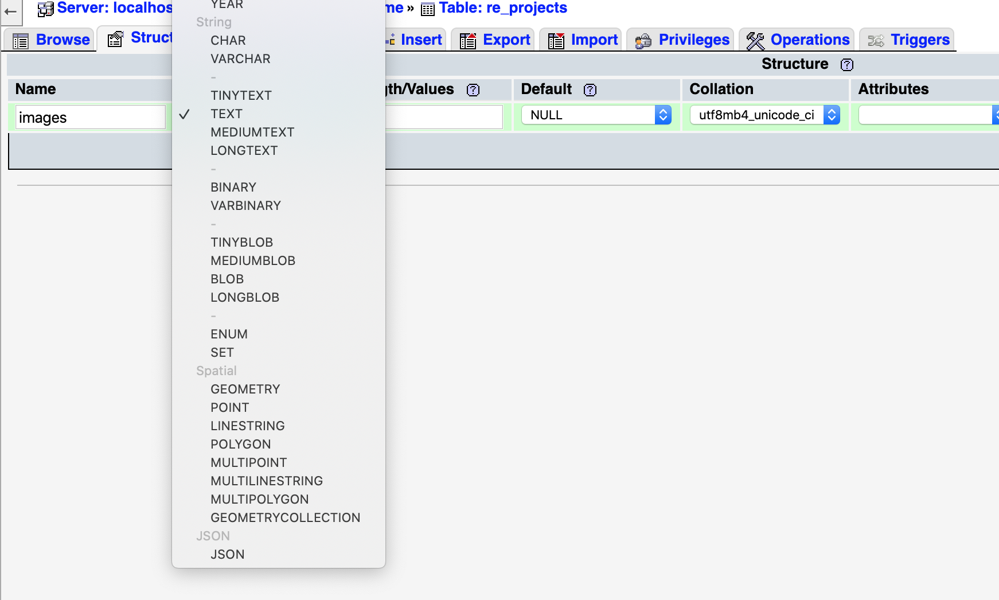

# Upgrade Guide

- [Upgrade to FlexHome 2.5](#version_2_5)
- [Upgrade to FlexHome 2.4](#version_2_4)
- [Upgrade to FlexHome 2.3](#version_2_3)
- [Upgrade to FlexHome 2.2](#version_2_2)
- [Upgrade to FlexHome 2.1](#version_2_1)
- [Upgrade to FlexHome 2.0](#version_2_0)
- [Upgrade to FlexHome 1.3](#version_1_3)
- [Upgrade to FlexHome 1.2](#version_1_2)
- [Upgrade to FlexHome 1.1](#version_1_1)

## Upgrade to version 2.5
- Override folder `app`, `config`, `platform`, `public/themes` and `public/vendor` from the latest version.

- For developer:
    - Update file `composer.json` and `composer.lock` from new source code.
    - Delete folder `/vendor` then run `composer install` to upgrade vendor packages.
    - Run `php artisan migrate` to update database.
    
- For non-developer:
    - Override folder `/vendor` from the latest version.
    - Go to Admin -> Plugins then deactivate plugin Real Estate, Vendor, Payment then re-activate it.
    

## Upgrade to version 2.4
- Override folder `app`, `platform`, `public/themes` and `public/vendor` from the latest version.

- For developer:
    - Update file `composer.json` and `composer.lock` from new source code.
    - Delete folder `/vendor` then run `composer install` to upgrade vendor packages.
    - Run `php artisan migrate` to update database.
    
- For non-developer:
    - Override folder `/vendor` from the latest version.
    - Go to Admin -> Plugins then deactivate plugin Real Estate, Vendor, Payment then re-activate it.
    

## Upgrade to version 2.3
- Override folder `app`, `platform`, `public/themes` and `public/vendor` from the latest version.

- For developer:
    - Update file `composer.json` and `composer.lock` from new source code.
    - Delete folder `/vendor` then run `composer install` to upgrade vendor packages.
    - Run `php artisan migrate` to update database.
    
- For non-developer:
    - Override folder `/vendor` from the latest version.
    - Go to Admin -> Plugins then deactivate plugin Real Estate then re-activate it.

## Upgrade to version 2.2
- Override folder `platform`, `public/themes` and `public/vendor` from the latest version.

- For developer:
    - Update file `composer.json` and `composer.lock` from new source code.
    - Delete folder `/vendor` then run `composer install` to upgrade vendor packages.
    - Run `php artisan migrate` to update database.
    
- For non-developer:
    - Go to Admin -> Plugins then deactivate plugin Real Estate then re-activate it.
    

## Upgrade to version 2.1
- Override folder `platform/plugins/real-estate`, `resources/lang/vendor`, `platform/themes/real-estate`

- For developer:
    - Update file `composer.json` and `composer.lock` from new source code.
    - Run `composer install` to upgrade vendor packages.
    - Run `php artisan migrate` to update database.
    
- For non-developer:
    - Go to Admin -> Plugins then deactivate plugin Real Estate then re-activate it.

## Upgrade to version 2.0

- Override folder `app`, `platform`, `public/themes` and `public/vendor` from the latest version.

- For developer:
    - Update file `composer.json` and `composer.lock` from new source code.
    - Delete folder `/vendor` then run `composer install` to upgrade vendor packages.
    - Run `php artisan migrate` to update database.
    
- For non-developer:
    - Update folder `/vendor` from the latest version.
    - Go to Admin -> Plugins then deactivate plugin Real Estate then re-activate it.
    
- Go to admin and activate plugins: Social Login, Vendor, Payment.

## Upgrade to version 1.3
- Override folder `platform`, `public/themes`, `public/vendor` and `vendor` from version 1.3.
- Run command `php artisan migrate` to update database or change column `images` in table `re_properties` & `re_projects` to `TEXT`

## Upgrade to version 1.2

- Override folder `/platform` from new source code.
- Update file `composer.json` and `composer.lock` from new source code.
- Delete folder `/vendor` then run `composer install` to upgrade vendor packages
- Run `php artisan vendor:publish --tag=cms-public --force` to update assets.
- Run `php artisan cms:theme:assets:publish` to update theme.

## Upgrade to version 1.1

- Override folder `/platform` from new source code.
- Update file `composer.lock` from new source code.
- Delete folder `/vendor` then run `composer install` to upgrade vendor packages
- Run `php artisan vendor:publish --tag=cms-public --force` to update assets.
- Run `php artisan cms:theme:assets:publish` to update theme.
